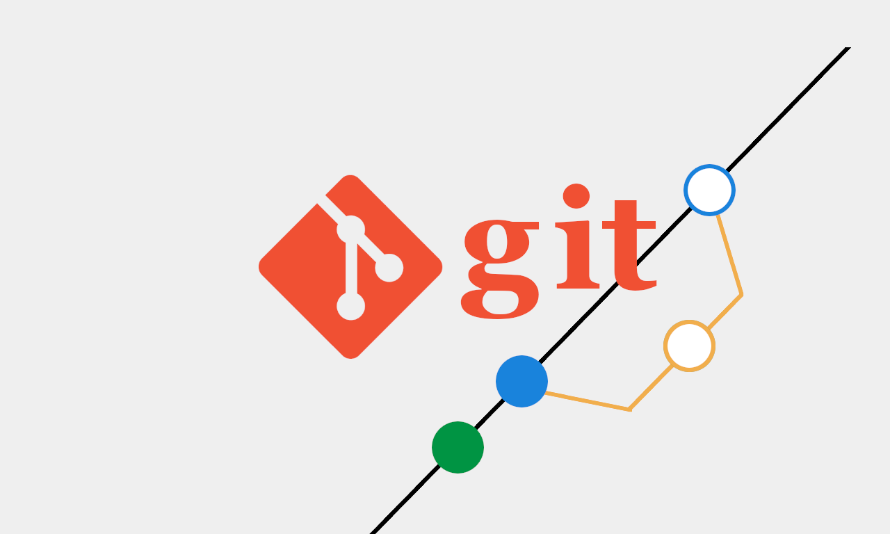

Gitで文書をチーム管理する方法
===
#
<ul class="page-1-list">
  <li class="text">キット分かる！
プログラムソースコード管理だけじゃない 
GITの活用法</li>
  <li class="img"></li>
</ul>

---
## 0️⃣ 自己紹介

- **名前** : 弓削田　公司（ゆげた　こうじ）
- **会社** : 株式会社 MYNT 代表取締役
- **Web** : https://myntinc.com
- <a class="flex" href="https://blog.myntinc.com">https://blog.myntinc.com</a>
- <a class="flex" href="https://www.facebook.com/yugeta.koji">https://www.facebook.com/yugeta.koji</a>
- <a class="flex" href="https://x.com/yugeta_koji">https://x.com/yugeta_koji</a>

---
## 1️⃣ はじめに

* **GITの歴史**：Gitを知ろう！〜業務効率化のための第一歩〜
  - Linusが3日でGitを作った
  <!-- Linuxの開発者の Linus Torvalds が、2005年4月にわずか3日ほどでGitの初期バージョンを書き上げた。-->

  - GITが作られた経緯は、Linux開発でライセンス問題が発生したため。
  <!-- Linuxカーネルの開発でBitKeeperの**ライセンス問題**が起きたため。-->

  - Gitという名前の由来は自虐的ジョーク
  <!--「git」はイギリスのスラングで「嫌なやつ」「バカ」という意味もあり、Linusが自分自身を指してそう名付けたとも言われている。-->

  - Linuxは、「クソ野郎（Bastard）のツール」と自称した。
  <!-- Linusは「私はクソ野郎（Bastard）で、私の作るツールはクソ野郎向けのツールだ」と笑いながら言っていた。つまり強力で便利だけど、最初は扱いが難しかった。 -->

---
## 2️⃣ セミナーのゴール
- Gitでできることを知る
  <!-- 
  - Gitは、無料で使える。
  - Gitは、過去の状態に戻せる。
  - Gitは、Gitは、どの部分を誰が編集したか追跡できる。
  - Gitは、複数人で同時に開発できる。
  - Gitは、バックアップできる。
  - Gitは、パラレルワールドが作れる。
  - エンジニア／開発職
    - プログラムコード（プロジェクト一式）
  - デザイナー
    - 画像など
  - ライター・編集者
    - ドキュメント
    - 複数人で編集やレビュー
    - リリースごとのタグつけ管理
  - マーケティング職
    - キャンペーンの履歴管理
    - ABテストのパターン管理
    - レポートの変更管理
  - カスタマーサポート／営業
    - FAQやナレッジベースの管理
    - テンプレート管理
    - 問い合わせ対応フローの見える化
  - マネジメント・PM
    - 議事録やドキュメントの管理
    - タスク定義やスケジュールのバージョン管理
    - レポート・分析資料のレビュー体制構築
  - 共通の工夫
    - メモや備忘録をテキスト管理（マークダウン）
    - ブログの公開（github pagesでできる）
    - 仕事書類などの総合管理
  -->
- 導入のイメージを持つ
  <!--
  - Gitを学ぶときは、まず「どんなことができるツールなのか」という全体像を持つことが大切。
  - いきなりコマンドや操作を覚えるよりも、「Gitを使うと履歴を残せる」「安全に過去に戻せる」「複数人で開発を進められる」というイメージを持つと理解が早い。
  - 例えば、ファイルを「スナップショット」で残しておけるカメラのようなもの、と考えると捉えやすい。
  - 自分の作業の安全ネットを用意する、そんな感覚を持つと導入しやすい。
  -->
- 今日から使える基本操作を学ぶ
  <!--
  - 事前にGITの使用歴や、印象などをヒアリングしてみる。
  -->

---
## 3️⃣ Gitって何？なぜ必要？

* 変更履歴を残せないと何が困る？
  <!--
  - Excelファイルの上書き事故
  - 履歴不明問題
  - 最新版がどれかわからない問題や、ファイル名で判断できない問題
  - USBメモリ管理をしていたけど、複数のメモリがある場合に、どれがどれだかわからなくなる。
  -->
* Gitは「ファイルのタイムマシン」
  <!--
  エクセルでも、履歴を戻す機能がありますが、そんなに意識して使っていないかも。
  仕事の資料で謝って消しちゃったとか、間違って書いちゃった時に、巻き戻しができてしまうのがGIT
  GITはパラレルワールドが作れるので、色々なお試し版が作れたりもする。
  -->
* よくある勘違い：Gitは難しい？→ 実はシンプルな仕組み！
  <!--
  人間だれでも、知らないことは、怖い事、難しい事、苦手な事と考えがち。
  でも、知っている事は、胸を張って行動できる。
  GITは、難しいポイントもあるけど、基本操作だけ知っているだけでも十分に使えるし、
  使っていくうちに、ちょっとずつ色々な事を覚えていけるので、使い続ける事が重要。
  基本的に、「パラレルワールドがどんどん作れるドラえもんのポケット」だと考えましょう。
  -->

---
## 4️⃣ Gitの基本構造を理解しよう

* **リポジトリって何？**（フォルダみたいなもの）
* **コミット＝スナップショットの保存**
* **ブランチ＝作業の分身**
* **ローカルとリモートの関係を図解で解説**
* **基本コマンドの紹介**（`init`, `add`, `commit`, `push`, `pull`）

---
## 5️⃣ 実演！Gitの基本操作

* **簡単なデモ**（例：ファイル作成→コミット→GitHubへのpushまで）
* **実演ポイント**

  * `git status`で状態確認
  * `git log`で履歴確認
* **よくあるエラー紹介**（例：pull忘れによるconflict）

---
## 6️⃣ 業務での活用事例

* **非エンジニア向け事例紹介**

  * 文書管理（議事録・マニュアル）
  * デザインファイル管理（LFS活用）
  * プロジェクト資料管理（社内ナレッジ共有）
* **チーム作業の流れ図（ブランチ・レビュー・マージ）**

---
## 7️⃣ 運用ルールの考え方

* **ブランチルール例**（`feature/` `fix/` `hotfix/`）
* **コミットメッセージ例**（Add/Update/Fix のPrefixルール）
* **アクセス権限の分け方**（管理者・編集者・閲覧者）
* **運用ルールは「守れるレベル」で設計**

---
## 8️⃣ 組織でのGit導入の進め方

* **導入ロードマップ例**（小さく始める→展開→全社展開）
* **教育・研修のポイント**（座学＋体験）
* **抵抗勢力への対処法**（便利さを実感させる・小さな成功体験）

---
## 9️⃣ まとめ

* **今日の学びを振り返り**
* **まずはこれだけ覚えよう！**

  * `add`, `commit`, `push`, `pull` の基本4つ
* **次のステップ紹介**（実践・練習のすすめ）
* **質疑応答タイム**

---
## 以上
