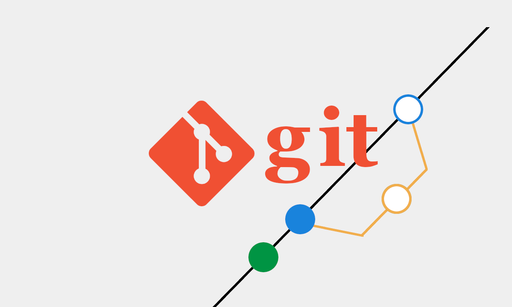

# Gitで文書をチーム管理する方法

<ul class="flex animate__animated animate__fadeInDown animate__slow">
  <li>
  <h2>キット分かる！</h2>
  <p>プログラムソースコード管理だけじゃない </p>
  <p style="font-weight:normal;">GITの活用法</p>
  </li>
  <li class="img">
    
  </li>
</ul>


---


# **自己紹介**

|||
|:-:|:--|
|Name|弓削田公司（ゆげたこうじ）|
|Job|株式会社 MYNT 代表取締役|
|Web|https://myntinc.com|
||<a class="flex" href="https://blog.myntinc.com">https://blog.myntinc.com</a>|
||<a class="flex" href="https://www.facebook.com/yugeta.koji">https://www.facebook.com/yugeta.koji</a>|
||<a class="flex" href="https://x.com/yugeta_koji">https://x.com/yugeta_koji</a>|


---
<a name="tod"></a>

# 目次

<div class="flex margin-auto">
<div class="text"><a href="#toc-1">1. Gitを知ろう！</a>
<a href="#toc-2">2. GIT とは？</a>
<a href="#toc-3">3. GITの歴史</a>
<a href="#toc-4">4. GITのヒント</a>
<a href="#toc-5">5. 事例紹介</a>
<a href="#toc-6">6. バージョン管理の仕組み</a>
<a href="#toc-7">7. Gitに出てくる用語</a>
<a href="#toc-8">8. 無料で学習できるサイト</a>
<a href="#toc-9">9. GIT便利ツール</a>
</div>
<div class="text">
<a href="#toc-10">10. ブラウザでコマンド操作</a>
<a href="#toc-11">11. 学習サイト</a>
<a href="#toc-12">12. 導入編</a>
<a href="#toc-13">13. 基本操作</a>
<a href="#toc-14">14. Githubのリポジトリ操作</a>
<a href="#toc-15">15. 活用事例</a>
<a href="#toc-16">16. 運用ルール例</a>
<a href="#toc-17">17. 教育研修の計画</a>
<a href="#toc-18">18. 抵抗勢力への対応策ほか</a>
<a href="#toc-19">19. 質疑応答</a>
</div>
</div>

---
<a id="tod-1"></a>


<p class="big">Gitを知ろう！</p>
<h2>〜業務効率化のための第一歩〜</h2>


---


# GIT 使ってます？
<p class="text left margin-auto">
このセミナーは、GITは聞いたことあるけど、
<b>使ったことない</b>人に
ちょっとだけ<b>興味</b>を持ってもらう事を
目的にしています。
</p>


---
<a name="tod-2"></a>


<p class="big">GIT とは？</p>


---


# 変更履歴を管理
## 誰がいつ何を変えたか<span class="red">記録する</span>仕組み


---


# 分散型バージョン管理システム
<p class="text left justify-content-center">
- みんなが自分のPCで履歴を持てる仕組み
- ネットがなくても作業＆履歴管理ができる仕組み
</p>


---
<a name="tod-3"></a>


<p class="big">GITの歴史</p>

## 知っておくと、誰かに話したくなる（かもしれない）


---


# 1. Linusが3日でGitを作った
<p class="text left justify-content-center">
  Linuxの開発者の Linus Torvalds が、
  2005年4月にわずか3日ほどで Gitの初期バージョン を書き上げた。
</p>


---


# 2. GITが作られた経緯
<p class="text left margin-auto">
Linuxカーネルの開発で、
「BitKeeper」の <b>ライセンス問題</b> が起きたため。
</p>


---


# 3. 名前の由来は自虐的ジョーク
<p class="text left margin-auto">
「git」はイギリスのスラングで
<b>「嫌なやつ」「バカ」</b>という意味もあり、
Linusが自分自身を指してそう名付けたとも言われている。
</p>


---


# 4. Linuxの発言
<p class="text left margin-auto">
Linusは「私はクソ野郎（Bastard）で、
私の作るツールはクソ野郎向けのツール(gitのこと)だ」と
笑いながら言っていた。<br>
つまり強力で便利だけど、最初は扱いが難しかった。
</p>


---
<a name="tod-4"></a>


<p class="big">GITのヒント</p>


---


# エンジニア以外でもGITが使えるアイデア**

<p class="text left margin-auto">
GITは、エンジニアだけの道具ではありません。
あらゆる職種で、“変化するもの”や“共同作業”にかかわるなら、
誰でもその恩恵を受けることができます。
</p>


---


# 1. エンジニア（使ってない人いないよね？）
<p class="text left justify-content-center">
- ソースコードの管理とバグ修正の履歴追跡
- 機能追加ごとのブランチ運用で安全な開発
- チーム開発でのコンフリクト（衝突）解決やレビュー対応
</p>


---


# 2. 企画職・マーケター
<p class="text left justify-content-center">
- キャンペーン施策案や提案資料のバージョン管理
- 修正履歴を活用して「なぜこのアイデアになったか？」を遡れる
- チームメンバーで資料を共同編集し、レビュー履歴を共有
</p>


---


# 3. デザイナー
<p class="text left justify-content-center">
- UIデザインやロゴ案など、デザインファイルの変更履歴管理
- バージョン違いの比較や、複数案の分岐管理に便利
- フィードバックを記録し、反映した修正の流れを可視化
</p>


---


# 4. ライター・編集者
<p class="text left justify-content-center">
- 原稿や記事の校正履歴を残せる
- 編集前後の比較が簡単で、過去の表現にすぐ戻れる
- 複数人での執筆プロジェクトでも、作業分担と統合がスムーズ
</p>


---


# 5. 営業・セールス
<p class="text left justify-content-center">
- 提案資料や価格表のバージョン管理（クライアント別など）
- 修正日・修正者の記録が残るので、チーム間での認識齟齬を防げる
- 過去にどんな資料を使ったかを履歴から確認可能
</p>


---


# 6. 人事・総務
<p class="text left justify-content-center">
- 社内規定やマニュアルの履歴管理
- 全社配布文書を安心して更新・共有できる仕組み
- 社内向けプロジェクトのドキュメントもGitで管理すれば一元化が可能
</p>


---


# 7. 教育・研修担当者
<p class="text left justify-content-center">
- 教材のバージョン管理・カリキュラムの履歴管理
- 複数人で作る研修資料のレビュー＆編集履歴が残せる
- 研修用リポジトリを配布して、受講者とやりとりすることも可能
</p>


---
<a name="tod-5"></a>


<p class="big">事例紹介</p>

## 東京大学工学部ホームページ
<p class="text margin-auto">
担当者から相談を受けてページ改善をした内容の紹介。
</p>


---


# 改善前ページ

||
|:-:|
||


---


# 問題点
1. ページ内の情報量が多い。
2. スマホで見てもPCと同じ表示。
3. フレームワークを使わず、全てのページがHTMLファイルで作成。
4. ホームページの更新作業をFTPで行っている。


---


# 改善後ページ

||
|:-:|
||

<a class="text margin-auto" href="https://www.ttc.t.u-tokyo.ac.jp/ttc/public/">
https://www.ttc.t.u-tokyo.ac.jp/ttc/public/
</a>


---


# 改善ポイント

1. ページデザインの修正
2. フレームワークを構築して、ヘッダ、フッダ部分と、コンテンツ部分を切り分け。
3. FTPではなく、GITを使って、オートデプロイ方式を構築。<span class="red bold">（←コレ！）</spam>


---


# 実施内容

1. ホームページデザイン、コーディングの再構築。
2. ホームページ担当者（東大技術職員7名）に対して、GIT教育を実施。
  期間 : 半年ぐらい
  ・環境構築 : 全員のPC端末にGITをインストール
  ・コマンド学習 : GITの基本コマンドをリファレンスに沿って説明＆ワーク
  ・運用ルール : ブランチやプッシュの仕方などを作成
3. リニューアル公開から、運用指導を実施
  期間 : 現在半年が経過


---


# 作業中の問題点や課題など

1. GITの学習を終えても、運用をしてみると、最初はミスも多い。
2. 最初はGighubで構築したが、セキュリティとコスト面から、サーバー内にリモートリポジトリを構築して、オートデプロイ処理を構築。
3. コンフリクトに対して、手慣れてもらうために、テストで何度もコンフリクトさせた。


---


# 導入効果 1

- 以前は、相互に同じファイルをアップした際に上書きしてデータを消してしまうトラブルが頻発していたが、GITを導入することで、ミスの巻き戻しも可能で、履歴も確認でき、誰がいつアップしたデータなのかを認識できるようになった。


---


# 導入効果 2

- チェック作業がほぼなくなり、コンフリクトチェックだけすれば良くなったので、大幅な時短に繋がった。


---


# 導入効果 3

- Markdown言語を合わせて学習することで、テキストで資料作成などが簡易にできるようになった。

- Markdownは、色々なメモ帳アプリなどでも使えるため、覚えていると通常の作業効率もアップします。

- ちなみに、このセミナー資料もMarkdownのテキストで作成しています。
- 構成 : VScode + Marp（プラグイン） + Mermaid（図などの描画）+ 画像ファイル


---
<a name="tod-6"></a>


<p class="big">バージョン管理の仕組み</p>

## 集中型と分散型の違い


---


# バージョン管理 集中型管理の概念


## snv , cvs , Perforce


---


# バージョン管理 分散型管理の概念


## Git


---
<a name="tod-7"></a>


<p class="big">Gitに出てくる用語</p>


---


# リモートリポジトリ

<p class="left margin-auto text">
共有リポジトリと言われる場合もある。
他の開発者と変更を共有するために使用されます。
多くの開発組織は、
Githubをリモートリポジトリとして使っている。
</p>


---


# ローカルリポジトリ

<p class="left margin-auto text">
各開発者は自分のパソコンに
リポジトリの完全なコピーを持ちます。
これにより、インターネット接続がない状態でも
開発作業を進めることができます。
</p>


---


# ブランチ(branch)

<p class="left margin-auto text">
ファイルの変更内容を、履歴として保存する操作。 
「ここまで作業した」という区切りを記録することで、 
後から見返したり、元に戻すことができるようになります。 
コミットには「変更内容のメモ（メッセージ）」をつけます。 
</p>


---


# プッシュ（push）

<p class="left margin-auto text">
ローカルリポジトリのコミット内容を 
リモートリポジトリに送信する操作。 
チームメンバーと変更を共有するために使います。 
</p>


---


# プル(pull)

<p class="left margin-auto text">
リモートリポジトリから最新の変更を取得し、 
ローカルリポジトリに取り込む操作。 
他の人の作業内容を反映させたい時に使います。 
</p>


---


# マージ(merge)

<p class="left margin-auto text">
別々のブランチで行われた変更を一つに統合する操作。 
たとえば、機能追加用ブランチで作業した内容を
メインブランチにまとめるときに使います。
</p>


---


# コンフリクト（conflict）

<p class="left margin-auto text">
複数のブランチで同じ部分が違う形で変更されたとき、 
どちらを採用するか決められず、Gitが自動でマージできない状態。 
手動で解決が必要になります。
</p>


---


# クローン（clone）

<p class="left margin-auto text">
リモートリポジトリの内容を、 
自分のパソコンにまるごとコピーして
ローカルリポジトリとして利用できるようにする操作。 
</p>


---


# タグ（tag）

<p class="left margin-auto text">
特定のコミットに「ラベル（目印）」を付ける操作。
よく使われるのは、リリースバージョンの記録（例：v1.0.0）。 
あとから「あの時点」をすぐに見つけるのに便利です。
</p>

##
```
A──B──C──D──E
            ↑
          [v1.0.0]
```


---


# ステージング

<p class="left margin-auto text">
コミットする前に、「このファイルを保存対象にする」と選ぶエリアのこと。
変更をいったん“控え室”に置くようなイメージです。 
その後、`git commit` で履歴に残します。
</p>


---


# リベース（rebase）

<p class="left margin-auto text">あるブランチの変更履歴を、別のブランチの上に載せ替える操作。
ブランチの流れを直線的に整理したいときに使います。 
ただし、使い方を間違えると履歴がぐちゃぐちゃになるため注意が必要です。</p>

###
**リベース前**
```
main:    A──B──C
feature:       └─ D──E
```

**リベース後**
```
main:    A──B──C──D──E
```


---


# コミット

<p class="left margin-auto text">
開発の分岐を管理するための機能。
新しい機能開発やバグ修正のために、
メインの開発ラインから分岐して作業を進め、
後でメインラインにマージすることができま
</p>


---
<a name="tod-8"></a>


<p class="big">無料で学習できるサイト</p>


---


# #1 Learn Git Branching
https://learngitbranching.js.org/
##

<!--課題に沿って、ゲームのように学習を進めていく事ができる。-->


---


# #2 Git Immersion
https://gitimmersion.com/
##

<!--英語だけどステップバイステップで学べる。-->


---


# #3 Oh My Git!
https://ohmygit.org/


<!--Gitをゲーム感覚で学べるオープンソースツール-->


---
<a name="tod-9"></a>


<p class="big">GIT便利ツール</p>


---


# 1. Git Explorer
https://git.gaozih.com/

<!--やりたいことから逆引き形式でコマンドを探せる-->


---


# 2. Git School – Visualizing Git
https://git-school.github.io/visualizing-git/

<!--ブランチ・コミットの構造を視覚的に学べる-->


---


# 3. CodeSandbox
https://codesandbox.io/

<!--Gitを使った開発がそのままWebブラウザで体験できる環境-->


---
<a name="tod-10"></a>


<p class="big">ブラウザでコマンド操作</p>


---


# GitHub Codespaces
https://github.com/features/codespaces

<!--VSCode風で、学ぶより「触る」感覚-->


---
<a name="tod-11"></a>


<p class="big">学習サイト</p>

## リファレンスサイト


---


# Pro Git 日本語版
公式のGit解説書のオンライン日本語版
https://git-scm.com/book/ja/v2


---
<a name="tod-12"></a>


<p class="big">導入編</p>

## 自分のパソコンにインストールする方法


---


# GUI? CUI?

<p class="text left margin-auto">
- GUI(アプリケーション)は、見た目でわかりやすい。
- CUI(コマンド)は、全ての機能が使える。
</p>


---


# GUIツール
## SourceTree
https://www.sourcetreeapp.com/<br>


---


# CUIツール
https://git-scm.com/downloads<br>


---
<a name="tod-12"></a>


<p class="big">基本操作</p>


--- 


# コマンド一覧
<ul class="flex-wrap">
<li><b>リポジトリ操作系</b>
- git clone
- git init
</li>

<li><b>ブランチ操作系</b>
- git branch
- git checkout
</li>

<li><b>ステージ操作系</b>
- git staths
- git add
- git commit 
- git tag
</li>

<li><b>コミット操作系</b>
- git push
- git pull
- git merge
- git fetch
</li>

<li><b>履歴操作系</b>
- git log
- git reset
- git revert
- git rebase
</li>

<li><b>難易度高い系</b>
- git cherry-pick
- git reflog
</li>
</ul>


---
<a name="tod-13"></a>


<p class="big">Githubのリポジトリ操作</p>

## 簡単操作体験


---


# 使用ツール

**このURLにアクセス**
> https://github.com/features/codespaces


---


# clone


**githubから、リポジトリをローカルに clone (コピー)する**

##
```
git clone https://github.com/yugeta/sample
```


---


# ファイル操作をして、次のコマンド

<p class="text left">
新規ファイルを追加
ファイルの内容を更新
</p>

##
```
git add . ← ドットを忘れずに
git commit -m '修正作業'
```


---


# コミット内容を確認

## 
```
git log
```

##
コマンドを実行して表示された文字を理解してみましょう。


---
<a name="tod-14"></a>


<p class="big">NAS活用事例</p>


---


# NasにGitリポジトリサーバーが搭載できる事例

<p class="text left margin-auto">
NAS(Network Attached Server)に、
Gitサーバーがインストールできる機器があります。<br>
- Synology
- Qnap （うちの会社はコレ）
- UGREEN<br>
(他にも色々あります・・・)
</p>


---


# NASにGitサーバーを構築するメリット

<p class="text left margin-auto">
1. 会社（組織）内のみで管理できるので、情報漏洩の心配がない。
2. Githubは、容量制限や、各種セキュリティ制限があるが、
   そうした制限が一切ない。
3. Actionsなどの機能が無料で使い放題。
（Actionsは、ホームページのオートデプロイなどで使う機能）
</p>


---


# NASのGitサーバーデメリット

<p class="text left margin-auto">
1. 社内や自宅に置いているため、電気代がかかる。
2. 設置作業や、保守管理などが自己責任。
</p>


---


# オススメの方法

<p class="text left margin-auto">
1. NASのバックアップにGithubなどのクラウドサービスを使う。
2. 運用ルールはクラウドサービスに合わせる。
3. Actionsは、NASサーバーで行うことで、無駄な金額発生を防ぐ。
4. 外部会社との連携はGithubで行う。
（クラウドでは、publicとprivateを使い分ける）<br>
もちろん、Githubのみでの運用も問題ありません。
</p>


---
<a name="tod-15"></a>


<p class="big">運用ルール例</p>

## GITをチーム運用する時に必要なルール


---


# 1. 個人開発向け：シンプル運用

<p class="text left margin-auto" style="font-size:0.8em;">
- main ブランチのみで作業
- コミットメッセージは「何をしたか」が明確になるように記述
  例：fix: ログイン時のバグ修正
- 毎日の作業終了後に git push
- タグでバージョン管理（例：v0.9）
</p>


---


# 2. 少人数チーム向け：軽量ブランチ運用

<p class="text left margin-auto" style="font-size:0.8em;">
- main：リリース用ブランチ
- dev：開発中の統合ブランチ
- 個人作業ごとに feature/ ブランチで作業
  例：feature/add-login
- 完了後、dev にプルリクエスト（レビュー）
- main へのマージは代表者のみ実施（週1など）<br>
※プルリクエストは、Githubの機能です。
</p>


---


# 3. 中規模チーム向け：標準運用

## （GitHub Flow風）
<p class="text left margin-auto" style="font-size:0.8em;">
- main：常にデプロイ可能な状態を維持
- 作業ごとに feature/ ブランチを作成
- プルリクエストベースでレビュー＆マージ
- GitHub Actions等で自動テスト連携
- main へのマージ後、自動デプロイ（CI/CD）
</p>


---


# 4. 大規模・多チーム向け：リリース＆長期保守運用

## （Git Flow風）
<p class="text left margin-auto" style="font-size:0.8em;">
- main：本番用（タグ付きでリリース管理）
- develop：次リリース向けの統合開発ブランチ
- feature/：新機能追加
- release/：リリース準備用ブランチ
- hotfix/：本番での緊急修正
- 厳密なレビュー・CIテスト・承認フローあり
</p>


---


# 5. ドキュメント・非エンジニアチーム向け

<p class="text left margin-auto" style="font-size:0.8em;">
- main：本番用（タグ付きでリリース管理）
- develop：次リリース向けの統合開発ブランチ
- feature/：新機能追加
- release/：リリース準備用ブランチ
- hotfix/：本番での緊急修正
- 厳密なレビュー・CIテスト・承認フローあり<br>
CIテストは、継続的自動テストの意味。
</p>


---


# 6. ドキュメント管理チーム向け

## （例：広報・人事・マニュアル担当）

<p class="text left margin-auto" style="font-size:0.8em;">
<b>ブランチ構成</b>
- main：公開状態のマニュアルや文書を置く
- edit/○○：内容修正や更新ごとの作業ブランチ
  例：edit/2025-rule-update
<b>ルール例</b>
- 修正内容ごとに必ずブランチを分ける
- プルリクエストでチーム内レビューを行ってから main へマージ
- コミットメッセージは「何を変えたか」を簡潔に
  例：fix: 入社手続きの説明文を更新
</p>


---


# 7. 企画・営業資料チーム向け

## （例：マーケター・セールス）
<p class="text left margin-auto" style="font-size:0.8em;">
<b>ブランチ構成</b>
- main：最新の正式提案資料など
- proposal/クライアント名：顧客別の資料バージョン
  例：proposal/ABC-corp
<b>ルール例</b>
- 資料提出前にレビューを行い、確認者がチェックしてからマージ
- バージョン番号タグで、提出資料を明確に記録
  例：v2025-07-05-ABC
<b>推奨フォーマット</b>
- .pptx もGitで管理可能
（バイナリなのでdiffは取れないが履歴保存には使える）
</p>


---


# 8. コンテンツ制作チーム向け

## （例：ライター・編集者）

<p class="text left margin-auto" style="font-size:0.8em;">
<b>ブランチ構成</b>
- main：公開中のコンテンツ
- draft/タイトル：記事や投稿の下書きブランチ
  例：draft/ai-tool-review
<b>ルール例</b>
- 下書きは1ブランチ1記事
- レビューを受けてから main にマージ、公開時にタグを付ける
  例：tag: blog-2025-07-10
<b>運用補足</b>
- Markdown形式で書くと、差分も確認しやすく便利
- 画像は /assets/ などにまとめて管理
</p>


---


# 9. 社内文書チーム向け

## （例：総務・法務）

<p class="text left margin-auto" style="font-size:0.8em;">
<b>ブランチ構成</b>
- main：最新の全社向け文書・規定集
- review/○○：修正案や監査用の修正ブランチ
  例：review/契約書フォーマット改訂
<b>ルール例</b>
- 文章の修正は issue に起票してから対応
- 修正理由と背景をコミットメッセージに残す
  例：refactor: 法改正に合わせて条文を更新
<b>セキュリティ</b>
- クローズドなGitサーバー
（GitHub EnterpriseやGitLab、NASなど）を活用
</p>


---


# 10. 教育・研修資料チーム向け


<p class="text left margin-auto" style="font-size:0.8em;">
<b>ブランチ構成</b>
- main：最新の公開済み教材
- update/年度やテーマ：改訂用ブランチ
  例：update/2025-spring-basic
<b>ルール例</b>
- 研修終了後のフィードバックを元に内容を更新
- バージョンタグ付きで教材配布履歴を管理
  例：v2.1-新人研修2025春
<b>補足</b>
- マークダウン教材とPDFをセットで管理することで、
  編集と配布の両立が可能
</p>


---


# よくあるルール設定例（共通）

<p class="text left margin-auto">
- コミットメッセージの書き方統一
  例：[fix] バグ修正 / [add] ログイン機能追加
- 禁止事項：mainに直接pushしない、force pushしない
- レビュー体制：最低1人以上のレビューでマージ可能
- 命名ルール：feature/xxx, bugfix/xxx, hotfix/xxx
</p>


---


# コミットメッセージ例

## 目的

<p class="text left margin-auto">
何を、なぜ、どのように変更したのかを明確にする
チームメンバー間の認識齟齬をなくす
あとで履歴を見ても「意味が通じる」ようにする
</p>


---


# コミットメッセージ例

## 基本ルール

**書き方の型（シンプル版）**

```
php-template
コピーする
編集する
<種別>: <変更内容の要約>

<b>例</b>
fix: 誤字を修正
add: 新しい提案書テンプレートを追加
update: 2025年度の研修資料を最新版に更新
```


---


# コミット種別（prefix）

## 書き方の型（シンプル版）

|種別|意味・用途|例|
|:--|:--|:--|
|add|	新規追加（資料・文書・機能）	|add: 新しいFAQセクションを追加|
|fix|	バグや誤字、内容ミスの修正	|fix: 資料の日付表記ミスを修正|
|update|	内容や表現の調整・更新	|update: トーンを調整して説明を読みやすくした|
|remove|	不要なファイル・記述の削除	|remove: 古い仕様書を削除|
|refactor|	構成・表現の整理（意味は変えない）	|refactor: セクション構成を整理|
|docs|	ドキュメントの追加・修正	|docs: READMEに注意事項を追記|


---


# NG例と改善例

|NG例|	改善例|
|:--|:--|
|修正|	fix: 表記ゆれを修正|
|aaa、test|	add: 動作確認用テストファイル追加|
|更新しました|	update: 年度表記を2025年に変更|


---


# コミットメッセージのルール化

## ルールを守ると得られる効果

<p class="left text margin-auto">
誰が見ても「何をしたか」がすぐに分かる
レビューや調査がスムーズになる
ドキュメントとしても役立つログが残る
</p>


---
<a name="tod-16"></a>


<p class="big">アクセス権限について</p>


---


# 目的

<p class="text left margin-auto">
- 間違った操作や意図しない変更からリポジトリを守る
- チームメンバーの役割に応じて、安全かつ効率的な運用を実現
- 「誰が何をできるか」を明確にし、トラブルを未然に防ぐ
</p>


---


# 権限ロール（役割）定義の例

|ロール|	できること|	想定される対象者|
|:--|:--|:--|
|管理者|	すべて（設定変更、権限付与、削除、強制push）|	プロジェクトマネージャー、技術責任者|など|
|メンテナー|	ブランチ保護設定、マージ、タグ付け|	チームリーダー、信頼された担当者|
|開発者|	ブランチ作成、プルリク作成、編集|	エンジニア、ライター、デザイナーなど|
|閲覧者|	リポジトリの閲覧のみ|	上長、外部レビューア、他部署関係者など|


---


# 推奨ルール設定例（GitHub／GitLab等を想定）

## ブランチ保護ルール（main, masterなど）
<p class="text left margin-auto">
直接 push を禁止（強制）
誤操作による上書き防止
プルリクエスト（Merge Request）経由のみマージ可能
レビューを必須化
レビューア2人以上で承認
チームでの品質担保
CIテスト通過必須（開発用の場合）
</p>


---


# 推奨ルール設定例（GitHub／GitLab等を想定）

## 書き込み権限の制限
<p class="text left margin-auto">
main に push できるのは管理者・メンテナーのみ
develop, feature/* は開発者もpush可
docs/ フォルダのみ編集可能なチーム（非エンジニア用）を作成可能
</p>


---


# 非エンジニア向け配慮ポイント

<p class="text left margin-auto">
Git初心者には限定的な権限を付与（例：閲覧・編集のみ）
docs用サブリポジトリを作って権限を分離
プルリクエスト時に説明テンプレートを用意
 例：「何を、なぜ変更したか」「レビューしてほしいポイント」
</p>


---


# 役割変更や退職時の対応

<p class="text left margin-auto">
リポジトリのオーナーが定期的にメンバーリストを確認
不要なアカウント・チームは速やかに削除または無効化
設定変更や削除操作のログ取得（GitHub Audit Log、GitLab Activityなど）
</p>


---


# サンプル：アクセス権ルール表（小規模チーム向け）

|操作|	管理者|	メンテナー|	開発者|	閲覧者|
|:--|:--|:--|:--|:--|
|リポジトリ設定変更|	✅|	❌|	❌|	❌|
|main ブランチに push|	✅|	✅|	❌|	❌|
|プルリクエスト作成|	✅|	✅|	✅|	❌|
|プルリクのレビューとマージ|	✅|	✅|	❌|	❌|
|docs/ フォルダ編集|	✅|	✅|	✅|	❌|
|リポジトリの閲覧・クローン|	✅|	✅|	✅|	✅|


---


# 補足：トラブルを防ぐヒント

<p class="text left margin-auto">
運用ポリシーをREADMEやCONTRIBUTING.mdに明記する
Slackやメールと連携してPRの通知を飛ばす
週次でマージログやアクティビティをレビュー
</p>


---
<a name="tod-17"></a>


<p class="big">教育研修の計画</p>


---


# 目的

<p class="left text margin-auto">
Gitの基本概念と操作を習得し、
業務ドキュメントや資料を安全かつ効率的に管理できるようにする。
チームでの共同作業時に起こる「上書きミス」や「履歴の混乱」を防止する。
非エンジニア職にも使いやすいGit運用習慣を根付かせる。
</p>


---


# スケジュールサンプル（全４回）
|回数|	テーマ|	内容概要|
|:--|:--|:--|
|第1回|	Gitの基本概念と操作体験|	バージョン管理とは？、Gitの用語<br>clone・commit・push体験|
|第2回|	実務で使えるGit操作|	ブランチ作成<br>pull・merge<br>コンフリクト対応の簡単な練習|
|第3回|	チーム作業での運用ルール|	プルリクエスト<br>レビューの流れ<br>コミットメッセージのルール|
|第4回|	非エンジニア向け活用事例共有|	ドキュメント管理、資料レビュー<br>共同編集の具体例 / 振り返りと質疑応答|


---


# 使用教材・ツール案

<p class="left text margin-auto">
<b>オンライン演習：</b>
GitHub Codespaces、GitPod、または仮想PC環境
<b>スライド教材</b>
Marp形式やGoogle Slidesなど
<b>ハンズオン用の教材リポジトリ</b>
例：sample-docs, training-branching
<b>チートシート</b>
Gitコマンド早見表
</p>


---


# 受講対象者とレベル分け

|タイプ|	対象職種|	内容のレベル感|
|:--|:--|:--|
|初心者|	総務・人事・営業・マーケ|	GUI中心操作、コミット・プルの体験|
|中級者|	ライター・ディレクター・デザイナー|	ブランチ運用・レビュー・コンフリクト対応|
|上級者|（補助）	エンジニア、チームリーダー|	補助スタッフ・質問対応係|


---


# 学習目標（例）

<p class="left text margin-auto">
Gitの役割やメリットを説明できる
自分の作業をコミット・プッシュして履歴を残せる
チームメンバーの変更をpullし、自分の作業と統合できる
ブランチやレビューを使った共同作業の流れを理解できる
</p>


---


# 研修を成功させるコツ

<p class="left text margin-auto">
いきなりコマンド操作ではなく、「なぜ使うのか？」から始める
GUIツール（GitHub Desktop / GitKraken など）を併用
ミスしても安心な「演習用リポジトリ」を事前に用意
ハンズオンの後に「実際の業務でどう使えるか」を結びつける
</p>


---


# オプション追加要素

<p class="left text margin-auto">
マニュアル更新プロジェクトでGit活用の実演
コミットメッセージやPRレビューのワークショップ
自社ルール化ドキュメント（CONTRIBUTING.md）の作成ワーク
</p>


---
<a name="tod-18"></a>


<p class="big">抵抗勢力への対応策ほか</p>


---


# よくある抵抗パターンとその背景

|抵抗の声|	背景・本音|
|:--|:--|
|「Gitって難しそう」「コマンド無理」|	ITツールへの不安、過去の失敗体験|
|「Excelで十分」「今ので困ってない」|	現状維持バイアス、変化への抵抗|
|「これ覚えるより本業が先」|	優先度が見えにくく、業務負荷に感じている|
|「失敗したら怖い」|	誤操作のリスクを過大視している|
|「Gitって技術者向けでしょ？」|	自分に関係ないと思っている|


---


# 対応策と工夫

## 1. 「体験してみる」→理解が進む
<p class="left text margin-auto">
演習を通して、「自分の作業に使える」と実感させる
例：研修資料の修正履歴がきれいに残っている例を見せる
</p>


---


# 対応策と工夫

## 2. GUIツールを活用する
<p class="left text margin-auto">
GitHub Desktop / Sourcetree / Visual Studio Codeなど
「コマンド覚えなくていいんだよ」と伝えるだけで安心感が生まれる
</p>


---


# 対応策と工夫

## 3. 小さく始める
<p class="left text margin-auto">
まずは一人で使う／ドキュメントだけで使うなど
成功体験を積んでもらい、他チームへ自然に波及
</p>


---


# 対応策と工夫

## 4. 上司・リーダーが先に使う
<p class="left text margin-auto">
「現場がやれと言ってる」より「上の人がもう使ってる」が効く
管理職が使えば、評価基準にも組み込みやすくなる
</p>


---


# 対応策と工夫

## 5. ミスしてもいい環境をつくる
<p class="left text margin-auto">
研修用リポジトリは壊しても大丈夫な設計に
revert や reset を教えておけば「戻せる安心感」になる
</p>


---


# 対応策と工夫

## 6. 成果・変化を“見える化”する
<p class="left text margin-auto">
Git導入前後でのドキュメント履歴の比較例を提示
「こういう場面で助かる」という具体例を共有
</p>


---


# 成功のカギは「共感」と「現場感」

<p class="left text margin-auto">
「覚えることが多い」ではなく「やることが減る」と伝える
ITっぽさよりも「文書の整理術」「編集の見える化」として紹介
「あなたのためのツールです」と寄り添った説明が◎
</p>


---


# おまけ：導入初期のプチ施策例

<p class="left text margin-auto">
「コミットメッセージ大賞」などのゆるイベント
Git用語かるた、Gitビンゴなどの学習ゲーム
導入初月は“Git相談役”を決めておく
SlackやTeamsで「Gitの小ネタ」投稿を週1回
</p>


---

<a name="tod-19"></a>


<p class="big">質疑応答</p>
<h2>この際だから何でも聞いてみよう！</h2>


---


## 以上

ご静聴ありがとうございました。


